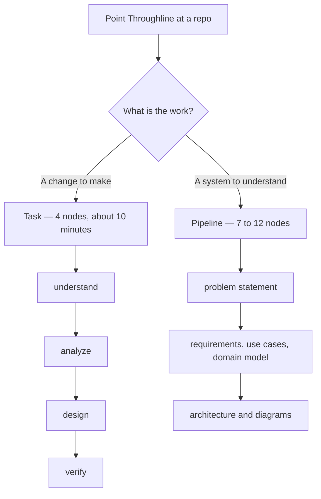

# Throughline

**Analysis and design that lives inside the repository it describes.**

[](https://github.com/RomansJefremovs/throughline/releases/latest)
[](https://www.python.org/)
[](#choose-your-agent)

Design documents rot because they live somewhere else. Throughline keeps them
in `docs/project/`, next to the code, and produces them through short
interviews rather than generation — so the person answering stays the author.

It is two things that fit together: a **CLI** that does everything
deterministic, and a **skill** that tells an AI agent how to run the
conversation on top of it. The model never decides what a node is, what is
stale, or what comes next. It asks questions and writes prose.

---

## The rules it is built on

These are not style preferences. Each one exists because the obvious
alternative makes the tool go unused.

| Rule | Why |
|---|---|
| **One next action. Never a list of what you haven't done.** | A backlog of undone documents is a reason to close the window. |
| **One question at a time, through a picker.** | Handing someone a draft to review gets "looks fine". Asking gets an answer. |
| **Every answer saved the moment it is given.** | A session dying mid-interview must cost you nothing. |
| **Staleness is never broadcast.** | No counts, no badges, no red. It is mentioned once, where you are already looking. |
| **Never load the whole repo.** | Scoped context per node, or the interview drowns. |
| **Four or five questions per node.** | Eight is the ceiling. If a node needs more, it should have been split. |

---

## Install

**Desktop app** — [download the latest installer](https://github.com/RomansJefremovs/throughline/releases/latest).
It carries its own Python, so the machine needs neither Python nor this
repository. Windows x64. The installer is unsigned, so SmartScreen will warn.

**From source:**

```bash
python -m pip install -e ".[dev]"
```

Then put the skill where your agent will look for it:

```bash
throughline skill install
```

One directory serves both Claude Code and opencode.

---

## Two ways to use it



### Tasks — for a bug, a ticket, a small feature

Four nodes, no architecture questions. **Use a task, not the pipeline, whenever
the work is a change rather than a system.** Running twelve nodes to fix a bug
is how a tool like this goes unused for most real work.

| Node | Produces |
|---|---|
| `understand` | what is being asked, in the user's own words |
| `analyze` | what is actually happening, and why |
| `design` | the change to make, and what it touches |
| `verify` | how you will know it worked |

`verify` is the node that pays for the rest — rework is unbilled, so the proof
is agreed before the fix is written.

```bash
throughline init --project "Sales" --task-only
throughline task new "Orders export drops the tax column" --origin ticket --reference ERP-4821
```

If the repo has an issue tracker or an MCP server, the agent pulls the ticket
itself rather than asking you to paste it.

### The pipeline — for a system

Seven nodes always. Three more appear only if the repo has a database,
meaningful state, or more than one service. Two more when you ask for them.

| Phase | Nodes |
|---|---|
| Problem | problem statement |
| Analysis | functional requirements · use case diagram · use case descriptions · domain model · test cases · *activity diagram* |
| Design | architecture · *ER model* · *state machine* · *deployment* · *sequence diagram* |

*Italic nodes are flag-gated or on demand.* Diagrams are mermaid, rendered in
the app and on GitHub.

```bash
throughline init --project "Sales" --flag has_db=true --flag multi_service=true
throughline status
```

**Existing repo?** `throughline scan` gathers the raw material — file tree,
README, recent commits, prior session transcripts — and the agent drafts every
node from it. Drafted is a real state, not a lesser *current*: it stays your
agent's guess until you have been walked through it and confirmed it.

---

## Setup — the cheap middle

Not every repo deserves twelve nodes. A repo where the work is fixing what
someone else specified needs four things, once:

| Records | Why |
|---|---|
| **What this is** | one paragraph, so a cold session knows where it is |
| **Vocabulary** | the highest-value part — their words, not yours |
| **How to run it** | launch, test and verify commands |
| **What it is wired to** | MCP servers, issue tracker, CI, launch configs |

`throughline detect` reads MCP declarations, launch configs, CI workflows and
the obvious run commands, so setup never asks what a file already answers.

That fourth row is the one that changes daily use: a repo with a ticket
integration means the task flow pulls the ticket instead of asking for a paste.

---

## Current and Target

A node can describe two things — what is true today, and what should be true.
Turn the second side on per repo:

```bash
throughline target on
throughline gaps
```

Each `##` under `# Target` is one gap. **Gaps are computed, never stored** —
there is no list to maintain and nothing to mark done. Promoting one into a
task is always your call:

```bash
throughline promote architecture "Split the billing service"
```

One real run produced a dozen gaps in an afternoon. Turning those into a
backlog automatically is exactly what rule 1 forbids, arriving by another door.

---

## Choose your agent

Throughline hands the work to **Claude Code** or **opencode**, chosen once and
remembered for every project.

```bash
throughline agent opencode
```

The desktop app asks the first time both are installed and never again —
change it any time from the **Agent** row in the project switcher. Only one
installed? It is used without asking.

opencode runs against any OpenAI-compatible endpoint, including a self-hosted
one, which matters most for the longest job Throughline does: reading an
existing repository and drafting every node from it.

---

## The app

```bash
throughline serve
```

A local server plus a Tauri desktop shell. It opens on the project you last
worked in and names exactly one action. From there you can read and edit any
artifact, see the map, start a task, add a project, and hand any node to your
agent — which opens a new console that outlives the app, so closing the window
never kills work in progress.

Edit a document in the app or in your editor, and the CLI will refuse to
overwrite it until someone has read what changed. Your sentences do not
disappear quietly.

---

## Command reference

| | |
|---|---|
| `init` | create the pipeline (`--task-only`, `--target-side`, `--flag name=true`) |
| `status` · `next` · `nodes` | where you left off, the one next node, everything active |
| `context <node>` | the scoped context for one node |
| `answer` · `write` · `confirm` | persist an answer, write an artifact, promote a draft |
| `stale <node>` | check one node against its inputs |
| `scan` · `detect` | raw material from a repo; what the repo is wired to |
| `setup` | write `setup.md` |
| `task new` · `list` · `answer` · `write` · `context` · `abandon` · `reopen` | the task flow |
| `target on` / `target off` · `gaps` · `promote` | the two sides |
| `agent` · `skill install` | which agent runs the work, and where its skill lives |
| `add` · `forget` · `projects` | which repos the app shows |
| `serve` | run the local app |

Every command takes `--repo <path>` and `--json`.

---

## Where things live

```
docs/project/
├── pipeline.yaml          state — the only file that is not hand-written prose
├── 01-problem.md          artifacts, numbered in reading order
├── 06-architecture.md
├── glossary.md
├── setup.md               what this repo is, and what it is wired to
└── tasks/
    └── 2026-08-18-orders-export/
        ├── task.yaml
        ├── 01-understand.md
        └── 02-analyze.md
```

Everything except `pipeline.yaml` is markdown you can edit by hand. Delete the
state file and you lose the bookkeeping, not a word of the content.

---

## Development

```bash
python -m pytest
```

380 tests, no network, no fixtures directory — every test builds what it needs
in a temporary directory.

**Build the Windows installer** (requires Rust and Node on `PATH`):

```bash
powershell -ExecutionPolicy Bypass -File scripts/build-installer.ps1
```

PyInstaller freezes the CLI, the app assets and the skill pack into one exe;
Tauri bundles that exe as a sidecar. The result lands in
`desktop/target/release/bundle/nsis/`.

| Directory | |
|---|---|
| `src/throughline/` | the CLI, the local server, and the app it serves |
| `skills/throughline/` | the skill that runs the interviews |
| `desktop/` | the Tauri shell |
| `docs/superpowers/` | design specs and implementation plans |

---

## Licence

[MIT](LICENSE) © Romans Jefremovs
