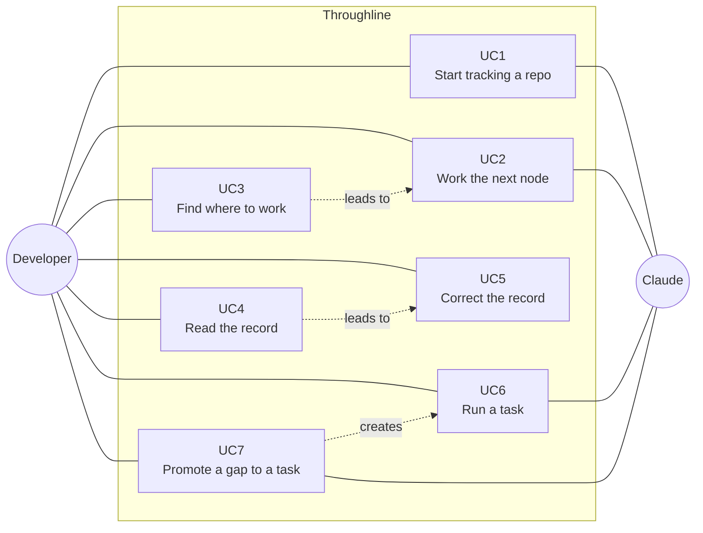
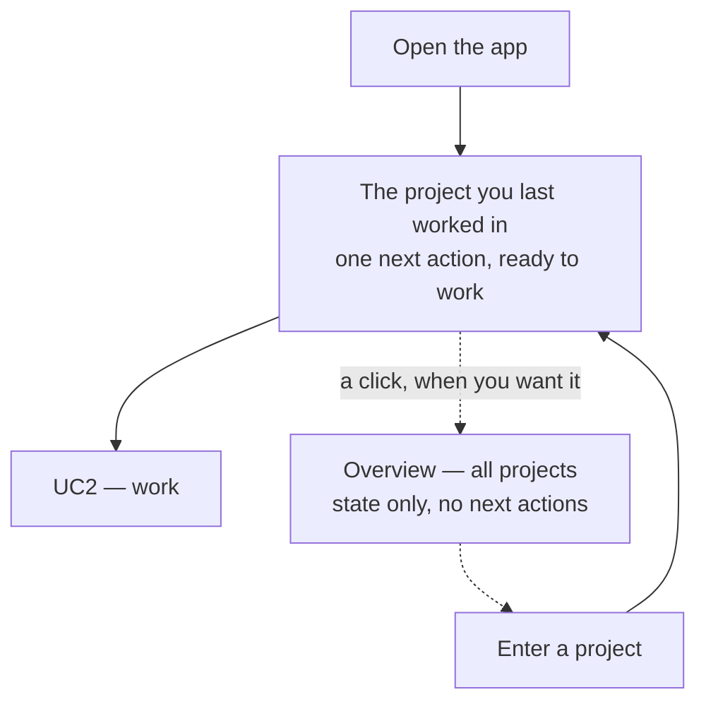

# Use case diagram

> Seven use cases across two actors - and the decisive one is UC3, which opens with no decision at all and keeps the overview behind a deliberate click.

Seven use cases, two actors. The interesting decisions are all about
where a use case *starts*, not what it does.

| Use case | What the developer is doing | Claude involved |
|---|---|---|
| **UC1** Start tracking a repo | Pointing the tool at a codebase for the first time | yes |
| **UC2** Work the next node | Answering an interview; an artifact comes out | yes |
| **UC3** Find where to work | Deciding which project gets this session | no |
| **UC4** Read the record | Looking up what was decided, and why | no |
| **UC5** Correct the record | Fixing a sentence that is wrong | no |
| **UC6** Run a task | A small unit of client work, start to verified | yes |
| **UC7** Promote a gap to a task | Turning an observation into work | yes |

**UC3 is separate from UC2 on purpose.** Choosing which project to work in
is its own act, not a step inside working — and it is the use case that
traces to the core job, managing projects plural.

# UC3 has two entrances, and only one of them is a decision

This is the design decision that shaped the rest.

**The front door contains zero decisions.** The app opens on the project
last worked in and names one next action. Choosing between five projects
is itself a decision, and a decision at the front door is where an ADHD
session ends before it starts.

**The overview is reached deliberately and shows state only** — which
projects are alive, roughly how far each has come. Never a next action per
project. Five projects each showing what you owe is five undone things on
one screen, which is precisely the shape rule 1 forbids.

This is the Obsidian model the tool was asked to feel like: it opens the
note you had open, and the vault switcher is present without being in your
face.

# UC2 — how the app hands over

Clicking the next node opens Claude Code in that repo with the node already
requested, so the user lands mid-interview.

**The app does not run the interview.** It stays a viewer and an editor.
Re-implementing the conversation would mean enforcing every binding rule in
two places, and the second copy would drift.

## Resume: the gap found while deciding this

Verified against the code, not assumed.

When a session dies mid-node, **the data survives and the conversation does
not**:

| | Survives a dead session |
|---|---|
| Answers already given | yes — rule 4 persists each one immediately |
| Which node is in progress | yes |
| *That you were partway through it* | **no** |
| Which questions were already asked | **no** — nothing reads them back |

The consequence is concrete: a fresh session runs `status`, sees the node,
and starts the interview at question one — asking what was already
answered. Meanwhile the "where you left off" line still describes the
*previous* node, because notes are written only when a node completes. It
reads as though nothing happened.

**Two fixes, for two different problems:**

1. **Status reads back the answers already given**, so the interview
   resumes at the next unanswered question. Stops repeated questions.
2. **Every saved answer refreshes the left-off line.** Stops the tool
   looking as though nothing happened.

Resume is a behaviour of UC2, not an eighth use case.

# UC5 — editing by hand has no visible consequence

Fixing a sentence in an upstream document produces **no marks, no
highlights, no counts** on the documents built from it.

The next time one of those documents is actually opened, one sentence says
its input changed, with a one-word way to dismiss it.

This is rule 5 applied to the app rather than only to the CLI — and it
matters here specifically, because the app is the surface where a staleness
badge would otherwise appear as an obvious, well-intentioned UI decision.

It is also the only legitimate use of capability 6: **staleness is computed
always and surfaced just in time**, to one person, in one place.
