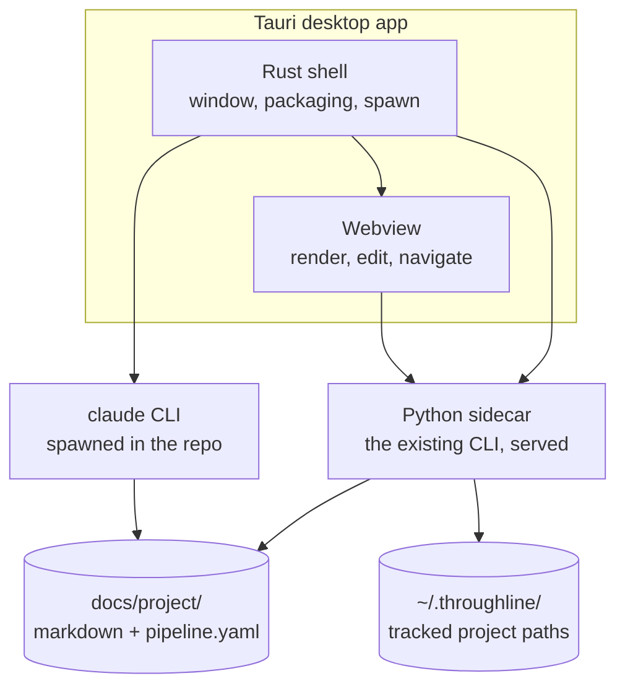

# Architecture

> A Tauri window around the Python that already exists - the shell is new, nothing else is, and the CLI stays the only place the rules live.

A Tauri window around the Python that already exists. The shell is new;
nothing else is.

# Delivery: a real desktop app

**Tauri.** Its own window, its own icon, launches like Obsidian.

Chosen over a local server opened in the browser. The costs are accepted
and worth stating plainly:

| Cost | Detail |
|---|---|
| Rust toolchain | Becomes a build dependency on Windows |
| Packaging and updates | Real work, and never finished |
| Startup | A sidecar process must be spawned and waited for |

**What does not change is the frontend.** Tauri hosts a webview either
way, so the screens are the same work under either delivery. The choice
buys a window and an icon; it does not change the app.

# The Python sidecar owns everything

The Rust shell spawns the existing CLI as a local server and shows its
pages. Rust stays thin enough to ignore.

**Rewriting the logic in Rust, and reimplementing it in the frontend, were
both rejected for the same reason.** The rules would then exist twice, and
the copy with 126 tests behind it would become the second-class one.

One implementation. One place to be right.

| Layer | Owns |
|---|---|
| Rust shell | The window, packaging, spawning processes |
| Webview | Rendering, editing, navigation |
| Python sidecar | Nodes, state, context assembly, hashing, status — all of it |
| Files | The truth |

# Handing off to Claude

**Both routes, chosen by a preference.** Both mechanisms were checked on
the machine rather than assumed:

| Mechanism | Status on this machine |
|---|---|
| `claude://` protocol handler | **Exists** — registered to `Claude.exe "%1"` |
| `claude.exe` on PATH | **Exists** — via WinGet links |

| Preference | What happens | Risk |
|---|---|---|
| **Terminal** | Spawn `claude` with the repo as cwd and the node as opening prompt | none — works today |
| **Claude Desktop** | Open `claude://` with a repo-and-prompt payload, fall back to the terminal if it does not take | payload undocumented |

**The CLI path is the default and is built first**, because it is also the
fallback — so it has to exist either way. That makes the deep link cost one
spike and a toggle, not a second implementation.

**The open question is what `claude://` accepts.** It may only handle
authentication callbacks. Until a spike settles it, Desktop is an option
that degrades silently to the terminal rather than a promise.

**Why both is right rather than indulgent:** the terminal always works and
never surprises, but Claude Desktop is where the work actually happens, and
landing there removes a window switch from the most-repeated action in the
product.

# Reading and editing

**Rendered by default, source on demand.**

| | |
|---|---|
| Reading | Formatted markdown, mermaid diagrams drawn |
| Editing | The block swaps to raw markdown in a plain text area |
| Saving | Writes the file exactly as typed |

This is Obsidian's real behaviour, and it needs only a renderer plus a
text area — no rich-text engine, no custom editor.

**Live preview was rejected despite being the nicest to use.** It is the
single hardest component in the build, it is where a schedule goes to die,
and a formatting-aware editor tends to rewrite the user's markdown — which
would break rule 10 directly.

## Verbatim means bytes

Saving writes **raw bytes**, and artifacts are written **LF on every
platform**.

This is not tidiness. A browser text area hands back LF whatever it was
given, and Python's text write translates newlines to the platform's. On
Windows those two combine to rewrite every line of a file on its first
save through the app — a whole-file diff the user never made. Found by
testing the round trip, not by reading the code.

## Vendored assets

**Mermaid ships inside the package**, 3.5MB, MIT licensed.

| Decision | Why |
|---|---|
| Vendored, not from a CDN | The app must work offline, and Tauri's CSP blocks external hosts anyway |
| The single UMD bundle | The ESM build lazy-loads from a 44MB tree of 130 chunk files |
| Loaded on first diagram, never at startup | The front door stays instant; opening a project fetches nothing but `app.js` |

**Assets are an allow-list, not a directory.** Nothing a caller sends is
ever joined onto a filesystem path, so there is no traversal to defend
against.

Markdown itself is rendered by a small parser covering exactly the subset
these artifacts use — headings, tables, fences, quotes, lists. A full
parser would be another megabyte of dependency for the same result.

# The one piece of state outside a repo

Everything about a project lives in that project's `docs/project/`. One
thing cannot: **the list of which projects exist.**

That goes in a single small file under the user's home directory, holding
paths and nothing else. It is a bookmark list, not a database — losing it
costs you the sidebar and no content whatsoever, and re-adding a folder
restores it completely.

**No index, no cache, no mirror of node state.** An index is the one thing
that can disagree with the files, and re-syncing it is exactly the
maintenance the product exists to avoid.

# Where the app could go wrong

| Risk | Why it matters |
|---|---|
| **Sidecar startup** | The window must not show an empty state while Python boots. Whatever it shows first, it must not look like data loss |
| **Two writers on one file** | The app edits an artifact while a Claude session writes the same one. Last write wins, silently |
| **Rust toolchain drift** | A build dependency you touch rarely is a build dependency that breaks when you need it |

The second is the real one. A Claude session and an open editor are the
normal case here, not an edge case.
