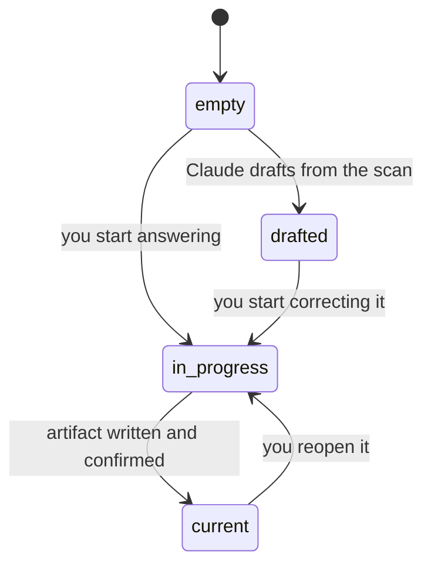
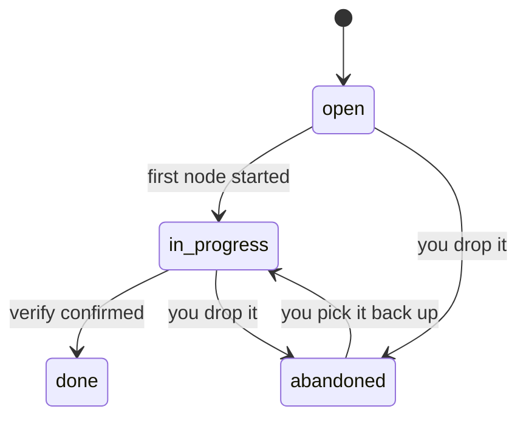

# State machine

> Four node states instead of three plus a boolean, a task lifecycle that can express abandonment, and staleness kept out of both on purpose.

Two machines: one for a node, one for a task. Staleness belongs to
neither, deliberately.

# Node

| State | Means |
|---|---|
| `empty` | Nothing yet |
| `drafted` | Claude wrote it from the scan. **Nobody has read it** |
| `in_progress` | Mid-interview. Some answers saved, artifact not written |
| `current` | Written, and confirmed by the person whose project it is |

## Four states, not three plus a boolean

The code had three statuses and a separate `confirmed` flag — four states
wearing three names. **This node specified the change; it has since
landed.**

The boolean disappeared into the status it was always encoding: a node with
`confirmed = False` and status `current` *is* a drafted node. Old files
still read correctly — `load` maps that pair to `drafted` on the way in.

Two commands carry it: `write --drafted` produces one, and `confirm`
promotes it. Nothing else may promote a node — confirming is the moment a
document stops being Claude's and becomes its owner's.

**Naming it matters because drafting became a real flow.** Pointing at an
existing repository produces a full set of drafted nodes in one pass, and
`drafted` is the honest word for what those are. Leaving the boolean in
place means the status field claims `current` for a document nobody has
read.

The distinction was already being rediscovered elsewhere: `status.next_node`
treats current-but-unconfirmed as its own priority. Two places found the
same missing state, which is usually the sign it should have a name.

# Staleness is not a state

**A node whose inputs changed stays `current`.**

Staleness is computed from stored upstream hashes at the moment someone
opens the node, and surfaced there as one dismissable sentence. It is never
stored as status, never aggregated, never drawn on the graph.

## Why it is kept out of the model

If staleness were a state, editing the problem statement would move **six
nodes out of `current` at once** — a screen of changed markers, arriving
unasked, for work nobody asked to be reminded of. That is precisely the
pattern rule 5 exists to forbid.

Deferring the transition until the user has looked was also rejected: a
state that depends on whether someone has looked at it cannot be trusted or
tested.

**Keeping staleness out of the state model enforces rule 5 in the data
rather than relying on interface discipline to hold the line.** Discipline
fails eventually; a state that does not exist cannot be rendered.

# Task

**A task carries its own lifecycle, stored on the task**, rather than
derived from the four nodes beneath it.

## The cost, stated plainly

This is the first field in the entire design that resembles a ticket
status, and it is a second thing that must be kept in step with the nodes
underneath it. The product otherwise avoids exactly this shape.

## What it buys

**Abandonment becomes expressible.**

A derived model cannot tell a task walked away from permanently from one
that will be picked up tomorrow. Both look like "some nodes done, some
not". So a dead task would compete for the single next-action slot
**indefinitely** — and the next action is the core promise of the product.

A task that can be honestly closed without being finished is what protects
it.

## Mitigations

| Rule | Effect |
|---|---|
| Node states stay authoritative for progress | Task status answers only whether the task is live |
| Task status is never aggregated | No count, anywhere — rule 9 holds |
| `abandoned` is reversible | Picking it back up is one step, not a new task |
