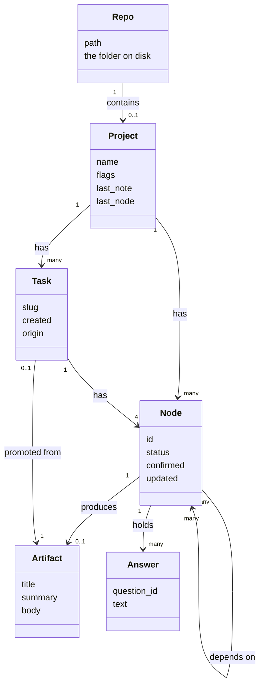

# Domain model

> Seven words, and the important one is Project - it beats pipeline and repo everywhere the user reads.

The vocabulary. This artifact is loaded into every later session, so the
names here are the ones that stick.

# The words

| Word | Means | Where it lives |
|---|---|---|
| **Repo** | The folder on disk | the filesystem |
| **Project** | What you are managing | `docs/project/` |
| **Node** | One step, one artifact | `pipeline.yaml` + a markdown file |
| **Artifact** | The document a node produces | `NN-name.md` |
| **Answer** | One saved reply to one question | `pipeline.yaml` |
| **Task** | A small unit of work, four nodes of its own | `tasks/DATE-slug/` |
| **Gap** | A difference between an artifact's two sides | nowhere — computed |

# Project is the word

**The code says pipeline, the folder says project, the disk says repo.**
Three words for one idea.

`Project` wins everything the user reads. The app says projects. The
switcher switches projects. The core requirement is literally *managing
projects, plural*.

`Pipeline` stays internal — the code and `pipeline.yaml` may use it;
nothing the user sees does. `Repo` keeps its narrow meaning: the folder a
project lives in.

This is a rename **toward** existing usage, which is the smaller and safer
direction.

# Node is two things, deliberately

| | Global or per-repo | Holds |
|---|---|---|
| `NodeDef` | global, ships in the package | id, title, phase, deps, activation, what it renders |
| `NodeState` | per repo, in your file | status, confirmed, answers, upstream hashes |

**The definition is not yours; the state is.** That split is why adding a
node to the package does not require touching any repo, and why deleting a
repo's `pipeline.yaml` loses your answers but not the method.

# A Gap is a reading, not a thing

A gap is the difference between an artifact's current and target sides,
**computed on demand and never stored.**

The alternative was considered and rejected:

> Storing gaps gives them a lifecycle. A lifecycle needs closing. Closing
> needs a list of what is still open — which is the tracker this tool
> exists not to be.

**Promotion survives without it.** When a gap becomes a task, the task
records the artifact and the sentence it came from. The lineage is kept;
the object never exists.

# Not entities

| Considered | Verdict |
|---|---|
| **Phase** — problem, analysis, design, code | A property of Node. Ordering, not a thing |
| **Flag** — `has_db`, `has_ui`, `has_state`, `multi_service` | A property of Project. Decides which nodes exist |
| **Question** | Lives in the skill's question banks, not in the data |

**Answer was nearly folded into Node and kept separate on purpose.** It is
the one thing rule 4 exists to protect — saved the instant it is given —
and something the design promises to never lose needs a name of its own.
